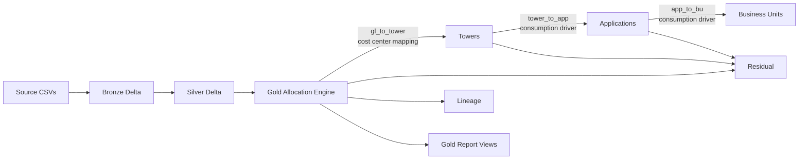

# tech-cost-platform

[](https://github.com/shervin-taheripour/tech-cost-platform/actions/workflows/ci.yml)
[](https://www.python.org/downloads/)
[](LICENSE)

A transparent, governed demo of multi-step IT cost allocation: `GL -> resource towers -> applications -> business units`, with residual cost surfaced explicitly instead of hidden.

## Positioning

Apptio's value is its pre-built standardized TBM taxonomy and an engine that runs cascading allocations at enterprise scale. This demo does not claim to replace that. It demonstrates that the modeling problem is understood deeply enough to implement the same cascading allocation logic in code, transparently and auditably, for clients who want a custom, governed, or in-house approach rather than a black-box licensed tool.

## What This Does

- Models a three-step allocation cascade with a separate driver at each step.
- Pins the entire cascade as versioned YAML rules.
- Preserves exact money reconciliation with staged rounding and deterministic remainder distribution.
- Surfaces residual cost with reason codes instead of force-spreading it.
- Proves the pure allocation core can run on two runtimes:
  - local: `delta-rs + DuckDB`
  - Databricks Free Edition: Spark Connect / Delta

## What This Does Not Claim

- It does not replace Apptio or provide a full TBM taxonomy.
- It does not claim enterprise scale, production orchestration, or performance tuning.
- It does not claim Delta time travel; local rewrites remove and replace table directories.
- It is not a benchmark of allocation quality — the synthetic fixture is deliberately imperfect.

## Why This Is a Data Engineering Problem

TBM / ITFM allocation is not just accounting arithmetic. It is a governed data pipeline problem:

- source costs arrive at one grain
- allocation drivers arrive at another
- each cascade step can fail differently
- reconciliation must hold exactly
- every modeling choice must be reproducible, explainable, and versioned

This repo focuses on that engineering surface rather than on vendor-specific UI or prebuilt taxonomy coverage.

## Architecture



## Five Depth Signals

- Multi-step drivers: [src/tech_cost_platform/engine/cascade.py](src/tech_cost_platform/engine/cascade.py)
- Driver variety and swappable strategies: [src/tech_cost_platform/engine/strategies.py](src/tech_cost_platform/engine/strategies.py)
- Residual handling and reconciliation: [src/tech_cost_platform/residual/report.py](src/tech_cost_platform/residual/report.py), [src/tech_cost_platform/residual/reconcile.py](src/tech_cost_platform/residual/reconcile.py)
- Lineage and round-trip auditability: [src/tech_cost_platform/lineage/trace.py](src/tech_cost_platform/lineage/trace.py)
- Rule versioning and controlled experiments: [config/rules/v1_transactions.yaml](config/rules/v1_transactions.yaml), [config/rules/v2_named_users.yaml](config/rules/v2_named_users.yaml), [src/tech_cost_platform/rules/](src/tech_cost_platform/rules)

## Residual Headline

The shipped default rule version, `v1_transactions`, allocates only `3,568.14` of `61,813.95`. The remaining `58,245.81` (`94.2%`) is residual.

That is not a failure of the demo. It is the point.

The synthetic fixture intentionally gives `cpu_hours` coverage only to `TWR-COMPUTE`, while the default cascade uses `cpu_hours` at `tower_to_app`. That means:

- `CC-LEGACY` exits as `unmapped` at `gl_to_tower`
- `TWR-LABOR`, `TWR-NETWORK`, and `TWR-STORAGE` exit as `driver_zero` at `tower_to_app`
- only the `TWR-COMPUTE` slice reaches `app_to_bu`

A model that hides unallocatable cost is manufacturing certainty. This one surfaces it.

Fresh run residual composition under `v1_transactions`:

| failed_step | reason_code | rows | amount_eur |
|---|---|---:|---:|
| `gl_to_tower` | `unmapped` | 8 | 8,303.00 |
| `tower_to_app` | `driver_zero` | 32 | 42,360.53 |
| `app_to_bu` | `driver_zero` | 24 | 7,582.28 |

The engine defines a third reason code, `shared_unattributable`, for sources that have no driver targets at all. It is exercised by other rule versions rather than by the shipped default. See [docs/DESIGN.md](docs/DESIGN.md) for the full reason-code semantics.

## Driver Comparison Result

The two shipped rule versions differ in exactly one place: `app_to_bu`.

- `v1_transactions`: allocates `3,568.14`
- `v2_named_users`: allocates `11,150.42`
- both reconcile to `61,813.95` exactly
- allocatable cost increases by `3.1x`

The strongest visible signal is `APP-BILLING`:

- under `v1_transactions`, the top BU is `BU-RETAIL`
- under `v2_named_users`, the top BU is `BU-CORP`
- the maximum absolute BU share swing is `49.94pp`

Same costs, same silver inputs, one YAML change, materially different answer.

## Runtimes

Local development runtime:

- `delta-rs + DuckDB`, no JVM
- full suite runs in roughly 90 seconds
- any reviewer can reproduce it with a normal Python environment

Databricks verification runtime:

- Free Edition serverless
- Spark Connect + Delta

The allocation core is runtime-agnostic. `engine/strategies.py` and the governed rule files contain no I/O and import with no storage dependencies; only the read/write layer differs between runtimes. Running the same core and the same rules on both produced identical monetary results to the cent:

| Rule version | Allocated | Residual | Total |
|---|---:|---:|---:|
| `v1_transactions` | 3,568.14 | 58,245.81 | 61,813.95 |
| `v2_named_users` | 11,150.42 | 50,663.53 | 61,813.95 |

Databricks notebooks live in [notebooks/](notebooks).

## Quickstart

Windows:

```powershell
python -m venv .venv
.venv\Scripts\python.exe -m pip install -e ".[dev]"
make PYTHON=.venv\Scripts\python.exe pipeline
make PYTHON=.venv\Scripts\python.exe test
```

Unix-like shells:

```bash
python -m venv .venv
.venv/bin/python3 -m pip install -e ".[dev]"
make PYTHON=.venv/bin/python3 pipeline
make PYTHON=.venv/bin/python3 test
```

## Docs

- Design rationale: [docs/DESIGN.md](docs/DESIGN.md)
- Architecture diagram: [docs/architecture.md](docs/architecture.md)
- Changelog: [CHANGELOG.md](CHANGELOG.md)
