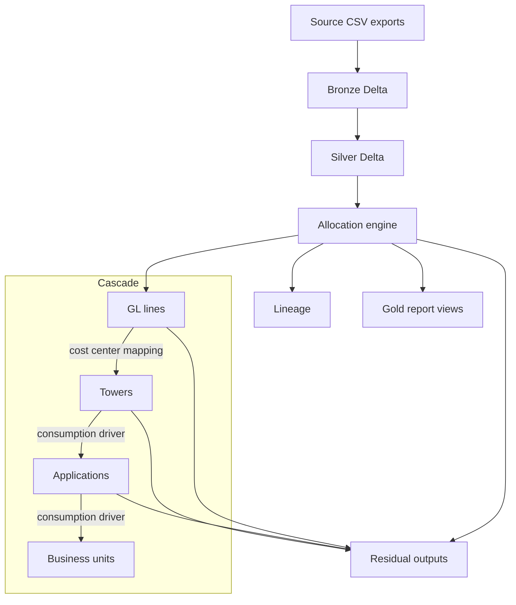

# Architecture

Interim Mermaid architecture diagram. P-012 replaces this with branded SVG.

```mermaid
flowchart TD
    source[Source CSV exports]
    bronze[Bronze Delta]
    silver[Silver Delta]
    engine[Allocation engine]
    residual[Residual outputs]
    lineage[Lineage]
    reports[Gold report views]

    source --> bronze --> silver --> engine
    engine --> residual
    engine --> lineage
    engine --> reports

    subgraph cascade[Cascade]
        gl[GL lines]
        tower[Towers]
        app[Applications]
        bu[Business units]
        gl -->|cost center mapping| tower
        tower -->|consumption driver| app
        app -->|consumption driver| bu
    end

    engine --> gl
    tower --> residual
    app --> residual
    gl --> residual
```
